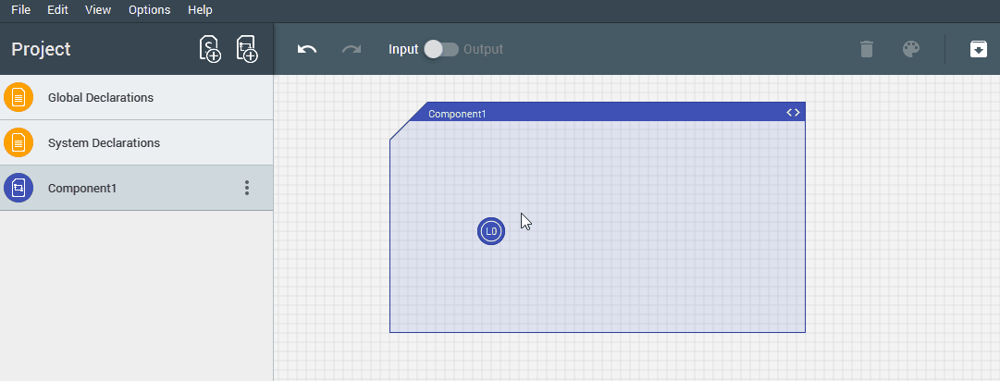
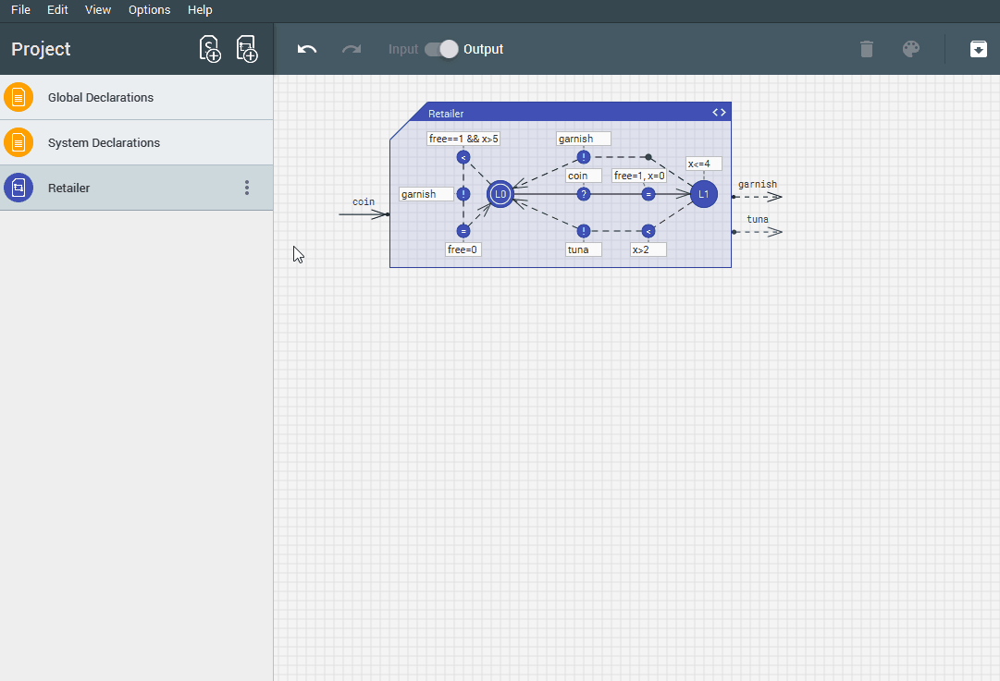

# Ecdar

Made by
----------
Casper Møller Bartholomæussen

Tobias Rosenkrantz Gundersen

Rene Mejer Lauritsen

Christian Ovesen

Installation
----
* Backend: Add a `server` file to query. Add a `verifytga` file to test.
  * If Windows: Add the `server.exe` and `verifytga.exe` files from the Ecdar 0.10 Windows distribution to the `\out\production\servers\bin-Win32` folder. 
  * If macOS: Add the `server` and `verifytga` files from the Ecdar 0.10 macOS distribution to the `/out/production/servers/bin-MacOS` folder. 
  * If Linux: Add the `server` and `verifytga` files from the Ecdar 0.10 Linux distribution to the `/out/production/servers/bin-Linux` folder. You can also add the `verifytga64` file instead and then rename it to `verifytga`, in order to run 64 bit verifytga when testing.

How to Run
----
Run Jar file with Java 8.

Known problems
----
* If you are having problems connecting to the backend, first of all make sure that you are connected to the internet. The backend needs to have a license file in order function. If that does not work then you are most likely missing a x32 libc6 library
`sudo apt-get install libc6:i386` .

* If the window is blank/white, run with java option `-Dprism.order=sw`.

H-UPPAAL
----------
This project is a hard fork of https://github.com/ulriknyman/H-Uppaal

Presentation
----
Modelling:

Conformance testing:

Sample Projects
----
* See `samples` folder.

Example models:

