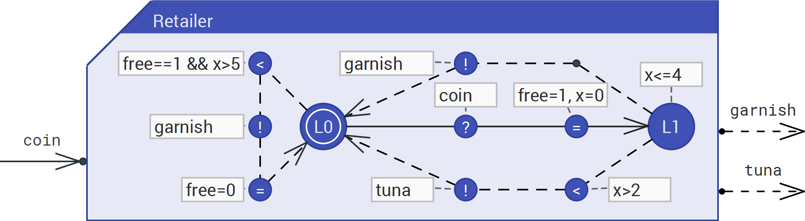
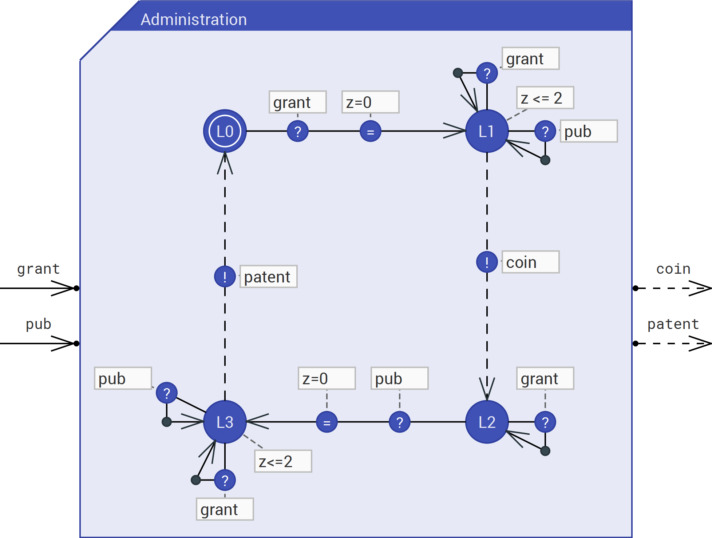
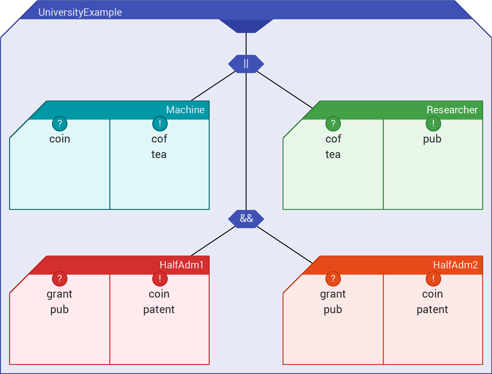
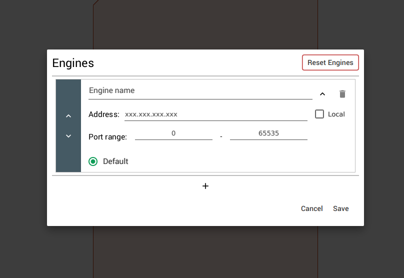

# Ecdar
Ecdar is an abbreviation of Environment for Compositional Design and Analysis of Real Time Systems.
This repo contains the source code for the graphical user interface. In order to run queries you will need the
j-ecdar and revaal executables.

> :information_source: If the goal is to use ECDAR, please goto the [main ECDAR repository](https://github.com/Ecdar/ECDAR), which contains releases for all supported platforms. These releases contain all dependencies, including the engines and a JRE.

## Screenshots
|    |  | 
|------------------------------------------------------------------------------------------------------------|------------------------------------------------------------|

## H-UPPAAL
This project is a hard fork of https://github.com/ulriknyman/H-Uppaal.

<a id="dependencies"></a>
## Dependencies
This section covers what dependencies are currently needed by the GUI.

### JVM
As with all Java applications, a working JVM is required to run the project.

You will need Java version 11 containing JavaFX. We suggest downloading Azul's Java 11 from https://www.azul.com/downloads/?version=java-11-lts&package=jdk-fx, as this is the version used by the main development team.

### Ecdar-ProtoBuf
This repository utilizes the [Ecdar-ProtoBuf repository](https://github.com/Ecdar/Ecdar-ProtoBuf) for the communication with the engines. This dependency is implemented as a submodule that needs to be pulled and updated. If you have not yet cloned the code from this repository (the GUI), you can clone both the GUI and the submodule containing the ProtoBuf repository by running the following command:

```shell
git clone --recurse-submodules git@github.com:Ecdar/Ecdar-GUI.git
```

If you have already cloned this repository, you can clone the ProtoBuf submodule by running the following command from a terminal in the GUI repository directory:

```shell
git submodule update --init --recursive
```

### Engines (needed for model-checking)
In order to use the model-checking capabilities of the system, it is necessary to download at least one engine for the used operating system and place it in the `lib` directory.

> :information_source: The latest version of each engine can be downloaded from:
> * https://github.com/Ecdar/j-Ecdar
> * https://github.com/Ecdar/Reveaal

The engines can then be configured in the GUI as described in [Engine Configuration](#engine_configuration).

## How to Run
After having retrieved the code and acquired all the dependencies mentioned in [Dependencies](#dependencies), the GUI can be started using the following command:
```shell
./gradlew run
```

> :information_source: All Gradle commands in this document are Unix specific, for Windows users, replace `./gradlew` with `./gradlew.bat`.

<a id="engine_configuration"></a>
## Engine Configuration
In order to utilize the model-checking capabilities of the system, at least one engine must be configured.
The distributions available at [ECDAR](https://github.com/Ecdar/ECDAR) will automatically load the default engines on startup, but this is currently not working when running the GUI through Gradle.
For the same reason, the `Reset Engines` button will clear the engines but will not be able to load the packaged once.

An engine can be added through the configurator found under `Options > Engines Options` in the menubar, which opens the pop-up shown below.



> :information_source: If you accidentally removed or changed an engine, these changes can be reverted be pressing `Cancel` or by clicking outside the pop-up. Consequently, if any changes should be saved, **MAKE SURE TO PRESS `Save`**

### Address
The _Address_ is either the address of a server running the engine (for remote execution) or a path to a local engine binary (for this, the _Local_ checkbox must be checked).

### Port range
The GUI uses gRPC for the communication with the engines and will therefore need at least one free port. This range directly limits the number of instances of the engine that will be started.
> :warning: Make sure AT LEAST one port is free within the specified range. For instance, the default port range for Reveaal is _5032_ - _5040_.

### Default
If an engine is marked with _Default_, all added queries will be assigned that engine.


## Exemplary Projects
To get started and get an idea of what the system can be used for, multiple examples can be found in the `examples` directory.
These projects include preconfigured models and queries to execute against them.

For the theoretical background and what the tool can be used for, please check out the latest research links at [here](https://ulrik.blog.aau.dk/ecdar/).

## Contributing
When contributing to this repository, make your own fork and create pull requests to this repo from there.

### Issues
If you find a bug or a missing feature, feel free to create an issue. The system is continuously under development and suggestions are always welcome.

If you create an issue, please add relevant tags (eg. `bug`, `feature`, etc.) as well as a detailed description.

### Pull Requests
Pull requests are continuously being reviewed and merged. In order to ease this process, please open a pull request as draft, as long as it is under development, to notify anyone else that a given feature/issue is being worked on.

Additionally, please add `Closes #{ISSUE_ID}` if the pull request is linked to a specific issue. If a PR addresses multiple pull requests, please add `Closes #{ISSUE_ID}` for each one.

A CI workflow is executed against all pull requests and must succeed before the pull request can be merged, so please make sure that you check the workflow status and potential error messages.

### Tests
All non-UI tests are executed as part of the CI workflow and hence must succeed before merging. The tests are written with JUnit and relevant tests should be added when new code is added. If you are new to JUnit, you can check out syntax and structure [here](https://junit.org/junit5/docs/current/user-guide/).

The test suite can be executed locally by running:
```shell
./gradlew test
```

> :information_source: Currently, the codebase has high coupling, which has made testing difficult and the test suite very small.

#### UI Tests
For features that are highly coupled with the interface, a second test suite has been added under `src/test/java/ecdar/ui`. These tests are excluded from the `test` task are can be executed by running:
```shell
./gradlew uiTest
```
These tests are more intensive to run and utilizes a robot for interacting with a running process of the GUI. The tests are implemented using [TestFX](https://github.com/TestFX/TestFX). As these tests are more intensive, they are not run as part of the standard CI workflow.

You should prefer writing non-UI tests, as they are less demanding and are part of the CI workflow.

### Code Organisation
The code within the project is structure based on the Model-View-ViewModel (**MVVM**) architectural pattern. However, the terms _Abstraction_, _Presentation_, and _Controller_ are used instead of _Model_, _View_, and _View-Model_ respectively.
This means that each element in the system consists of:
- An _Abstraction_ (located in `abstractions` package).
- A _Controller_ (located in `controllers` package).
- A _Presentation_ (located in `presentations` package).
  - Most of the presentations are related to an `FXML` markup file that specifies the look of the presentation. These files are located in `src/main/resources/ecdar/presentations`.

In addition to these, a `utility` package is used for additional business logic to improve separation of concern and enhance the testability of the system.

#### Abstractions
The abstractions are used to represent logical elements, such as `components`, `locations`, and `edges`. These classes should mostly be pure data objects. They are used to save and load data to and from existing project files.

#### Controllers
The controllers contain the business logic of the system. They function as the link between the UI and the abstractions.
This is implemented such that an action performed to an element in the UI triggers a method inside the controller, which then alters the state of the related abstraction.

They implement the `Initializable` interface and are initialized through their associated presentation when an instance of that is instantiated. Hierarchically, a presentation therefore contains a controller.

Each controller controls an instance of its related abstraction. If an action to one element should affect another element, this effect is enforced through the controller.

#### Presentations
As mentioned above, most of the presentations are split into a Java class and an FXML markup file. The Java class can be seen as a shell to initialize the FXML element from inside the business logic. It initializes the related controller and ensures that any needed elements are set within it. This allows the controllers to be initialized without any UI elements, which is very useful for testing, while ensuring that they are correctly connected while the UI is running.

The FXML files are markup specifying how the elements should look in the UI and have a reference to the related controller. Each element that should be addressable or changeable from the controller has an `fx:id` that is directly referenced as a member inside the controller. The direct connection to a controller allows events, such as `onPressed`, to trigger the correct methods in the controller and also helps IDEs identified any potentially missing methods or members.

> :question: **Why use both a controller and a presentation Java file?**\
> The advantage of during this is that the `controller` can contain all the business logic and bindings to the FXML elements, while the `presentation` can be used to instantiate and reference the UI elements inside the Java code. The `controller` should contain the logic and is bound within the FXML file, so the `presentation` Java file should be seen as a shell.

#### Utility
To increase the testability and separation of concern further, the `utility` package is introduced. This package includes useful functionality that is either used in multiple unrelated classes or outside the responsibility of the given class.

An example of one of the classes located in this package is the `UndoRedoStack` used to keep track of actions performed by the user.

#### Miscellaneous
Besides the packages mentioned above, some larger functionalities are located in their own packages. Here is a small description of each:
- `backend`: Responsible for the communication with the engines and model checking.
- `code_analysis`: Responsible for analysing the elements of the current project and construct messages if errors or warnings are encountered.
- `issues`: Classes for representing `Errors`, `Issues`, and `Warnings`.
- `model_canvas.arrow_heads`: Arrowheads used in the UI to visualize the direction of edges.